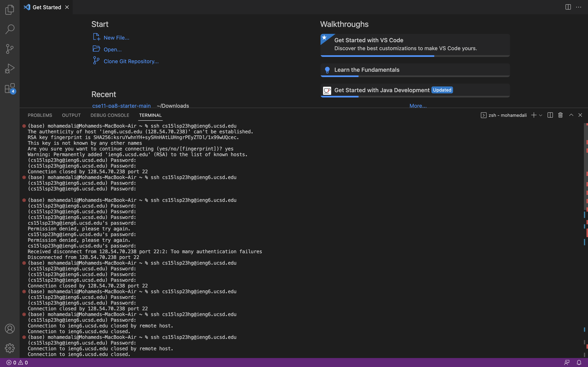
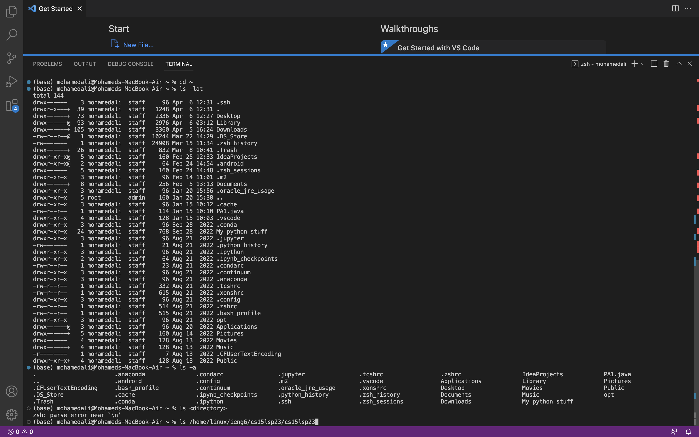

## How To Log In To Your CSE 15L Course-Specific Account 

To login to your CSE 15L course-specific account you need to go to find your username first by going to this [Link](https://sdacs.ucsd.edu/~icc/index.php)
and enter your PID and username from your UCSD email(your username is everything before the @ symbol. i.e m7ali@ucsd.edu).

It should look like this

You will then proceed to find the username associated with your CSE 15L account which should look like this cs15lsp23zz (zz will be replaced on yours) you want click you CSE 15L username and reset the password, which will take a couple of minutes for it to completly process.
When reseting the password make sure you use the CSE 15L username and not the other one you used to find it.

## Downloading Visual Studio Code

After completing that step you will then move on to downloading VSCode onto your Mac or Window device by going to this [Link](https://code.visualstudio.com/). I did not have to follow this step since I had already had VSCode downloaded onto my Macbook from last quarter since I had needed it to complete my assignments, but when installed it should look like this when you open it after it downloads.

## Remotely Connecting

Following that step is remotely connecting, which will need you to open up the terminal on VSCode ( a terminal can be opened by pressing Terminal → New Terminal menu option, I had found this easier since command or ctrl + didn't work for me). Once the terminal is opened you would like to enter ssh followed by your CSE15L emaill and password to ensure you are logged in. As you can see in the image that I had a difficult time logging in because I did not realize you couldn't see the how many charachters there were when entering the password, so just be a little more aware when entering the password. I receieved the message Connection to ieng6.ucsd.edu closed by remote host. Connection to ieng6.ucsd.edu closed. which was told to me was okay by the lab instructors.

When you see the message that says: The authenticity of host 'ieng6.ucsd.edu (128.54.70.238)' can't be established.
RSA key fingerprint is SHA256:ksruYwhnYH+sySHnHAtLUHngrPEyZTDl/1x99wUQcec.
This key is not known by any other names
Are you sure you want to continue connecting (yes/no/[fingerprint])?

You should say yes since it is your first time connecting to a server.

## Trying Commands
Now that you have been able to login you want to try using some of the commands on the terminal, some simple commands are using ls,cd,pwd,mkdir, and cp. If you would like to get specif you can use commands such as 
cd ~ 

cd 

ls ~lat

ls ~a

ls < directory > 
# What Do Some of These Commands Mean?

ls = lists the contents of a directory
cd = changes into a given directory
ls~ lat = lists all the files and directories in the current working directory or a directory that the user specifies.
ls~a = will list all files including hidden files

Here is how running some of these commands looks like:

  
  
