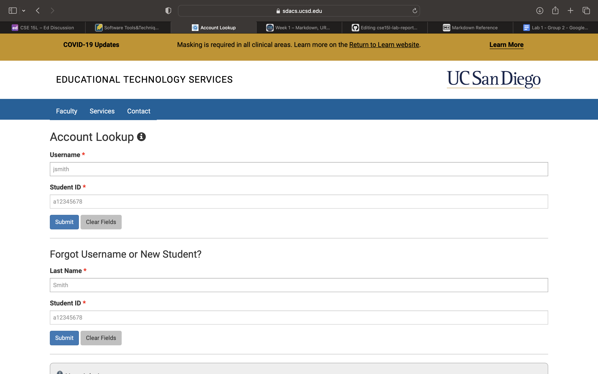
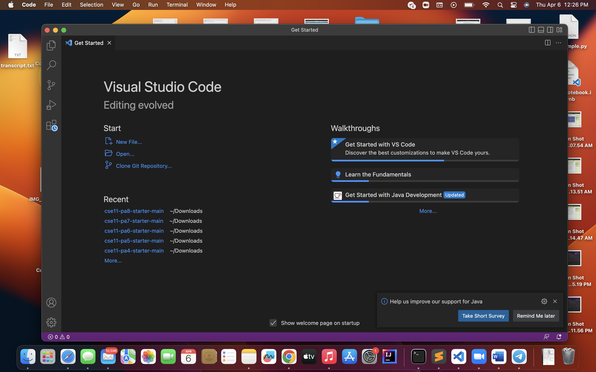

## How To Log In To Your CSE 15L Course-Specific Account 

To login to your CSE 15L course-specific account you need to go to find your username first by going to this [Link](https://sdacs.ucsd.edu/~icc/index.php)
and enter your PID and username from your UCSD email(your username is everything before the @ symbol. i.e m7ali@ucsd.edu).

It should look like this

You will then proceed to find the username associated with your CSE 15L account which should look like this cs15lsp23zz (zz will be replaced on yours) and reset the password, which will take a couple of minutes for it to completly process.

After completing that step you will then move on to downloading VSCode onto your Mac or Window device by going to this [Link](https://code.visualstudio.com/). I did not have to follow this step since I had already had VSCode downloaded onto my Macbook from last quarter since I had needed it to complete my assignments, but when installed it should look like this when you open it after it downloads.

Following that step is remotely connecting, which will need you to open up the terminal on VSCode ( a terminal can be opened by pressing Terminal → New Terminal menu option, I had found this easier since command or ctrl + didn't work for me). Once the terminal is opened you would like to enter ssh followed by your CSE15L emaill and passowrd to ensure you are logged in.
