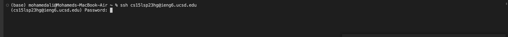

# Lab Report 4
Welcome to CSE 15L Lab Report 4. This week we're chronicling a walkthrough for the CLDQ (CSE Labs Done Quick) competition.

## Step 4: Log into ieng6
* `$ ssh cs15lsp23hg@ieng6.ucsd.edu` (Typed out command): Logged into ssh server
* Typed in my password  

## Step 5: Clone your fork
`$ git clone [https://github.com/andrewtran5222/lab7](https://github.com/ucsd-cse15l-s23/lab7.git)`(Typed out command): Clones the repository from GitHub

## Step 6: Run the tests
* `$ javac -cp .:lib/hamcrest-core-1.3.jar:lib/junit-4.13.2.jar *.java`(Typed out command)
* `$ java -cp .:lib/hamcrest-core-1.3.jar:lib/junit-4.13.2.jar org.junit.runner.JUnitCore ListExamplesTests`
1. `<up>`: copies the javac command
2. `<backspace>` 6 times (deletes `*.java`)
3. Typed: `ListExamplesTests`
4. Hold `<left>` (17 spaces): moves cursor to before `ListExamplesTests`
5. Typed: `org.junit.runner.JUnitCore `
6. Hold `<left>` (81 spaces): moves cursor to after `javac`
7. `<backspace>`: Deletes `c`
 
  
## Step 7: Edit the code
* `$ nano JavaExamples.java` (Typed out command)
* Change Line 43 to `index2 += 1;`
1. Hold `<down>` (42 lines): Moves cursor to Row 43
2.  Hold <right> (12 spaces): Moves cursor to after `index1`
3. `<backspace>`: Deletes `1`
4. Type `2`: Finishes replacing `index1` with `index2`
5. `Ctrl + X`, `y`, `<Enter>`: Exit command, confirm changes, confirm write out file

  
## Step 8: Run the tests
* `<up>` 3 times, `<Enter>`: Navigates to previous `javac` command, runs `javac` again
* `<up>` 3 times, `<Enter>`: Navigates to previous `java` command, runs `java` again

  
## Step 9: Commit and push
* `$ git add ListExamples.java`: Adds `ListExamples.java` to commits
* `$ git commit -m "fast"`: Commits the changes in a fast manner
* `git push`: Push the changes
1. `MoAli2004` (Typed out my username)
2. `<Right Click>` + `Paste`: Pasted my previously generated personal access token

